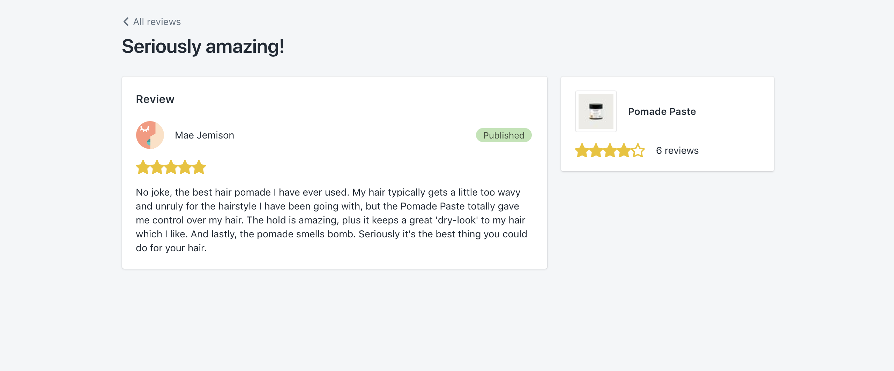
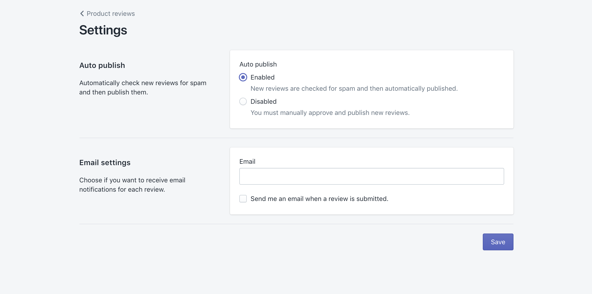
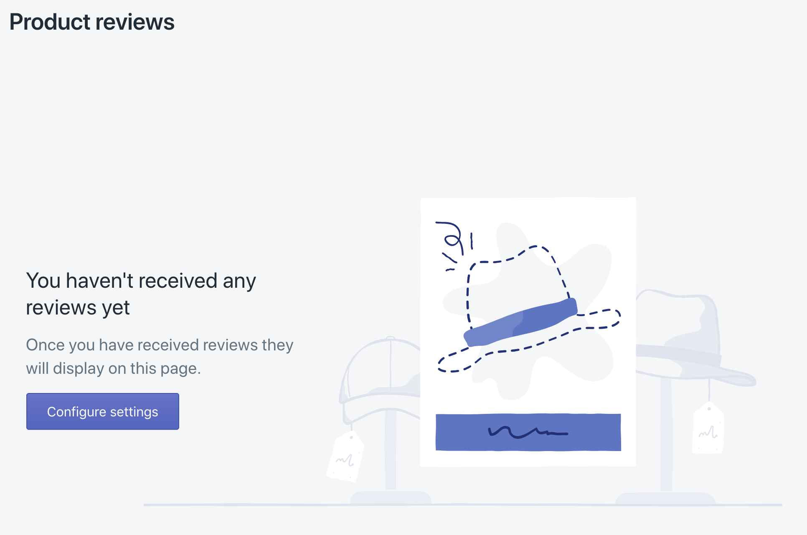
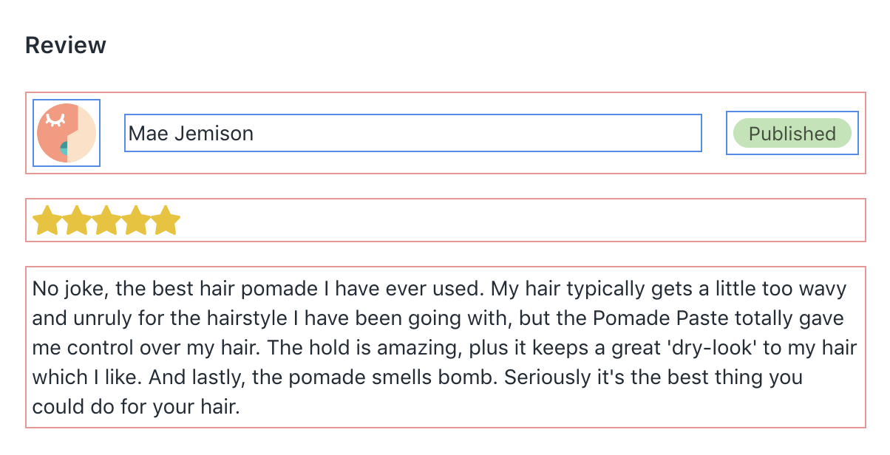

# Polaris Workshop

## Introduction to Polaris and the Style Guide - Dom

### What is Polaris?

* Shopify’s design system, provides a common framework with which to build high quality experiences for merchants and partners
* Consists of UI design and development kits, design and content guidelines and more

### How should you use it?

* Style guide
* Guidelines
* Component reference
* What’s new
* Examples

### Workshop overview

Together we will be building out a product review app so merchants can receive and manage customer submitted reviews on their products.

#### Goals

Give attendees a high level view of what Polaris (both the components and our documentation) can give them and an overview of the process of building an app using those tools.

#### Structure

* Introduction
* Building the product review app using Polaris React
* Q & A

We chose to rebuild this app using Polaris React components for this workshop because it is an excellent example of the common patterns you will come across when building out an app for Shopify merchants. It's got an index page, a show page, and a settings page.

At the end of this workshop you will have built something that looks like this.






[Live demo](https://polaris-product-reviews.glitch.me/)

## Step 1: Setting up your app (Dom)

`git clone git@github.com:Shopify/product-reviews-polaris-example.git`

Now change into the new directory we just cloned

`cd product-reviews-polaris-example`

Open up the project in your code editor. We will be using [Microsoft's VSCode](https://code.visualstudio.com/), but you are free to use whichever editor you prefer.

First we need to install the app dependencies

`npm install`

Now we can run our app with

`npm start`

We have set most of the app up for you. Let's open up `src/App.js` to take a look.

You can see we have set up a React Apollo client for GraphQL, as well as React Router for managing routing between the pages we are building.

We then import the styles and the [AppProvider component](https://polaris.shopify.com/components/structure/app-provider), which are required to start using Polaris in our project.

```jsx
import {AppProvider} from '@shopify/polaris';

import '@shopify/polaris/styles.css';
```

The `AppProvider` is must wrap our application. It allows for global configuration to be shared throughout the Polaris components. Things like translation strings, embedded app settings, and even what link component to use under the hood can all be configured using the `AppProvider`.

We configured our `AppProvider` to use the `Link` component that comes from React Router. This allow us to create the single page app feel as merchants navigate our app.

We created a custom link component that wraps the React Router link.

```jsx
const CustomLinkComponent = ({children, url, ...rest}) => {
  return (
    <Link to={url} {...rest}>
      {children}
    </Link>
  );
};
```

Then pass the custom link component to the `linkComponent` prop of the `AppProvider`.

```jsx
<AppProvider linkComponent={CustomLinkComponent}>...</AppProvider>
```

Now Polaris will automatically render React Router links anywhere that an `<a>` tag would normally be rendered by Polaris components.

Looking at the structure of the finished app, we will need to make use of the index and show structure. The index acts as the listing of reviews. The review index will help merchants scan and take action on their store's reviews, or navigate to the show page to see more details about an individual review.

I will hand it over to Chloe now, and she will walk us through the review index.

## Step 2: Review index (Chloe)

Go ahead and open up the review list file located at`src/routes/ReviewList.js`. If you scroll to the bottom of the file, you will see we have a GraphQL query setup to fetch the list of reviews.

This injects a `data` prop into our `ReviewList` component that gives us an array of "reviews" and a "loading" boolean that tells us whether or not we're still fetching the reviews.

```jsx
export default graphql(gql`
  query ReviewsQuery {
    reviews {
      id
      title
      status
      date
      customer {
        name
      }
      product {
        name
      }
    }
  }
`)(ReviewList);
```

Let's walk through how we've built out the UI of this page using the Polaris React component library.

### Page

When building a Shopify app with Polaris React, every view should start with a [Page](https://polaris.shopify.com/components/structure/page) component. All of the view's content will then nest inside of the page.

Below our dependency imports, you'll notice we've imported the page component from Shopify Polaris along with a few other components.

```jsx
import React from 'react';
import {graphql} from 'react-apollo';
import gql from 'graphql-tag';

import {
  Page,
  EmptyState,
  Card,
  ResourceList,
  SkeletonBodyText,
  SkeletonDisplayText,
  TextContainer,
} from '@shopify/polaris';
```

Then we've got a functional React component named `ReviewList` that returns the page.

```jsx
function ReviewList({data: {loading, reviews}}) {
  /* Content logic... */
  return <Page title="Product reviews">{/* Page content... */}</Page>;
}
```

The page component requires a `title` prop, which accepts a string to give the page a title.

So far, our page looks like this


There are a number of optional props the page component accepts as well. One of those optional props is a list of secondary actions. Let's head over to the [style guide](https://polaris.shopify.com/components/structure/page) to explore what the `secondaryActions` prop accepts as a value.

We want to add an action that will link to the settings page we've built so our page looks something like this.


We have already imported the gear shaped SVG we've included in this project. We'll use that as the icon property of our secondary action.

```jsx
import {settings} from '../icons';
```

Add a `secondaryActions` prop to the page component. Give it an array with a single object. This array will map to a settings button below our page title. As you can see in the style guide prop explorer, secondary action objects can have a lot of different properties. We will only give our settings action an icon, content, and url.

```jsx
<Page
  title="Product reviews"
  secondaryActions={[{icon: settings, content: 'Settings', url: '/settings'}]}
>
  {/* Page content... */}
</Page>
```

### Card

Now let's dig into the content of our page. When building a new view for your application you should always consider the different states your page will have based on the availability and quantity of the data being presented: loading, empty, some, and many.

#### Loading state

We start with the loading state content. This is what is shown while the network request fetches the review data through GraphQL.


We've wrapped the loading state content with a card component. Cards are used to group similar concepts and tasks together to make Shopify easier for merchants to scan, read, and get things done.

We hold the content of our loading state in a variable that uses the `loading` property of the `data` prop to determine whether or not we should show this content. Polaris comes with a set of skeleton content components that can be used to communicate to the merchant that data is currently being fetched.

* Let's go back to the [style guide](https://polaris.shopify.com)
* Use the search bar (top right) to find the "skeleton" components we've imported
* Once you get to a skeleton component page, look at the different examples provided by selecting from the example menu at the top of the page.
* Play with the component code in the playground and explore the props list
* Paste some skeleton content from the component playground into the text container of our loading state content.

```jsx
const loadingStatePageContent = loading ? (
  <Card sectioned>
    <TextContainer>
      <SkeletonDisplayText size="small" />
      <SkeletonBodyText />
      <SkeletonBodyText />
    </TextContainer>
  </Card>
) : null;
```

The loading state content is already a child of our page. We can see what our loading state looks like by uncommenting the two lines of code below line 18.

```jsx
/* Comment or uncomment the next two lines to toggle the loading state */
loading = true;
reviews = null;
```

### Empty state

Next, let's go over how to build out our page's empty state using the Polaris `EmptyState` component. This is what will be displayed when we aren't loading data but there are no reviews for the merchant's products yet.



Let's add the empty state component to our Polaris component import.

We store the content of the empty state in a variable just like we did for our loading state. We use the length of the `reviews` array we receive from the GraphQL query to decide whether or not to show the empty state.

```jsx
const emptyStateContent =
  reviews && reviews.length === 0 ? (
    <EmptyState
      heading="You haven't received any reviews yet"
      image="/review-empty-state.svg"
    >
      <p>Once you have received reviews they will display on this page.</p>
    </EmptyState>
  ) : null;
```

We can see what the empty state of our page looks like by commenting out lines 19 and 20, and uncommenting the code on line 23.

```jsx
/* Comment or uncomment the next two lines to toggle the loading state */
// loading = true;
// reviews = null;

/* Comment or uncomment the next line to toggle the empty state */
reviews = [];
```

Let's look at our page now that we've handled the case of a store without reviews. Uh oh, there's a lot of errors here! When running into errors with Polaris components, a good first step is to double check the style guide to make sure we haven't forgotten any required props.

Looking at the [empty state page of the style guide](https://polaris-v2.shopify.com/components/structure/empty-state), we see an asterisk next the `action` prop. This means adding an `action` prop to the empty state component is **required**. This is because it is a best practice to give merchants a relevant, meaningful next step they can take after reaching an empty page.

Let's add an action prop to our empty state component that will link the merchant to the settings page.

```jsx
<EmptyState
  heading="You haven't received any reviews yet"
  action={{content: 'Configure settings', url: '/settings'}}
  image="/review-empty-state.svg"
>
  <p>Once you have received reviews they will display on this page.</p>
</EmptyState>
```

Now we can see our empty state!

### Resource list

The last variable we create stores the content of the list of reviews. We use the length of the array of reviews we receive from GraphQL to determine whether or not we render the reviews list. To wrap our reviews list content, we use a card component just like we did for our loading state content.

To build the list of reviews, we will use the Polaris `ResourceList` component. `ResourceList` displays the key details of a collection of resources (reviews in this case) that allow a merchant to find, select, take bulk action on, or navigate to see more details about each resource.


Because every type of resource is different and requires different information to be shown, we allow you to customize the display of each item in the list by using a custom component instead of the `ResourceList.Item` subcomponent. For this app, we created a custom component called `ReviewListItem` and have already imported it into this file.

Let's start building our index. First, place a resource list component inside of the card in the `reviewsIndex` variable.

```jsx
const reviewsIndex =
  reviews && reviews.length > 0 ? (
    <Card>
      <ResourceList />
    </Card>
  ) : null;
```

Next, let's go back to the [Polaris style guide](https://polaris.shopify.com) and search for "resource list" so we can explore what props to pass into to our resource list.

* The `showHeader` prop optional and takes a boolean that toggles whether or not a heading with a count of the list items is shown.
* The `resourceName` prop is also optional. It takes an object that specifies the singular and plural names of the resources in question so the component can use them when referencing the resources in places like the heading. If left blank, the resource list will just default to calling them items.
* The `items` prop is required as well and takes an array of resource list item objects. We pass the resource list our array of reviews here.
* The `renderItem` prop is a callback used by the resource list to map out the list of resources the `items` prop receives. Here is where we will instruct the component to render each review with our custom `ReviewListItem` component.

```jsx
const reviewsIndex =
  reviews && reviews.length > 0 ? (
    <Card>
      <ResourceList
        showHeader
        resourceName={{singular: 'review', plural: 'reviews'}}
        items={reviews}
        renderItem={(review) => <ReviewListItem {...review} />}
      />
    </Card>
  ) : null;
```

The reviews index is the last child of our page component.

```jsx
<Page
  title="Product reviews"
  secondaryActions={[{icon: settings, content: 'Settings', url: '/settings'}]}
>
  {loadingStateContent}
  {emptyStateContent}
  {reviewsIndex}
</Page>
```

Finally, our reviews list view is complete!

<details>
<summary>Click to view the final state of the ReviewList.js code</summary>

```jsx
import React from 'react';
import {graphql} from 'react-apollo';
import gql from 'graphql-tag';
import {
  Page,
  EmptyState,
  Card,
  ResourceList,
  SkeletonBodyText,
  SkeletonDisplayText,
  TextContainer,
} from '@shopify/polaris';

import ReviewListItem from '../components/ReviewListItem';
import {settings} from '../icons';

function ReviewList({data: {loading, reviews}}) {
  const loadingStateContent = loading ? (
    <Card sectioned>
      <TextContainer>
        <SkeletonDisplayText size="small" />
        <SkeletonBodyText />
        <SkeletonBodyText />
      </TextContainer>
    </Card>
  ) : null;

  const emptyStateContent =
    reviews && reviews.length === 0 ? (
      <EmptyState
        heading="You haven't received any reviews yet"
        action={{content: 'Configure settings', url: '/settings'}}
        image="/review-empty-state.svg"
      >
        <p>Once you have received reviews they will display on this page.</p>
      </EmptyState>
    ) : null;

  const reviewsIndex =
    reviews && reviews.length > 0 ? (
      <Card>
        <ResourceList
          showHeader
          resourceName={{singular: 'review', plural: 'reviews'}}
          items={reviews}
          renderItem={(review) => <ReviewListItem {...review} />}
        />
      </Card>
    ) : null;

  return (
    <Page
      title="Product reviews"
      secondaryActions={[
        {icon: settings, content: 'Settings', url: '/settings'},
      ]}
    >
      {emptyStateContent}
      {loadingStateContent}
      {reviewsIndex}
    </Page>
  );
}

export default graphql(gql`
  query ReviewsQuery {
    reviews {
      id
      title
      status
      date
      customer {
        name
      }
      product {
        name
      }
    }
  }
`)(ReviewList);
```

</details>
<br />

Now Dom will walk us through building out the review detail page that each review in our resource list links to.

## Step 3: Review details (Dom)

If you need to catch up on step two, run `git stash && git checkout step3` in your terminal.

Now that we have our index page working, we will move onto the page to display the details for each review.

### Layout

Looking at our mockup or this page we will notice it should display in two columns on larger screens. We will use the `Layout` component from Polaris to do this.

Open up `src/routes/ReviewDetails.js` add a Page component with a breadcrumb and the layout inside of it.

```jsx
<Page title={review.title} breadcrumbs={[{content: 'All reviews', url: '/'}]}>
  <Layout />
</Page>
```

Inside that new layout we will add two sections. We add the `secondary` prop on the second one to signify that it should be the smaller of the two columns.

```jsx
<Layout>
  <Layout.Section />
  <Layout.Section secondary />
</Layout>
```

Inside those sections we will add a card to each which is where we will add our content for the page.

```jsx
<Layout>
  <Layout.Section>
    <Card title="Review" sectioned />
  </Layout.Section>
  <Layout.Section secondary>
    <Card sectioned />
  </Layout.Section>
</Layout>
```

### Stack

So where the `Layout` component works really well for that overall page layout, the `Stack` component is designed for laying out the micro layouts within the page.

Stacks can be used to align and space elements in a way that will wrap responsively based on the content size and the space available.

We are going to use two stacks, one nested inside the other to create the following layout.



We will start with the vertical stack.

```jsx
<Card title="Review" sectioned>
  <Stack vertical />
</Card>
```

Placing elements inside of this `Stack` will lay them out vertically with consistent spacing. Let's output the rating and content from the review to see how it works.

```jsx
<Card title="Review" sectioned>
  <Stack vertical>
    <Rating value={review.rating} />
    <p>{review.content}</p>
  </Stack>
</Card>
```

We can then use a nested Stack to get the `Avatar` and customer name side by side within it. We are also going to use the alignment prop to centre the elements vertically.

```jsx
<Card title="Review" sectioned>
  <Stack vertical>
    <Stack alignment="center">
      <Avatar customer name={review.customer.name} />
      <p>{review.customer.name}</p>
    </Stack>
    <Rating value={review.rating} />
    <p>{review.content}</p>
  </Stack>
</Card>
```

### Badge

Next we want to add something to tell the merchant whether the review is published or not. We will use the `Badge` component for this. Badges are used to inform merchants about the status of something.

We will want the color and content of this badge to reflect the status of the review. To do that we will use a ternary operator to switch between the two variations based on status.

```jsx
const badge =
  review.status === 'published' ? (
    <Badge status="success">Published</Badge>
  ) : (
    <Badge status="attention">Unpublished</Badge>
  );
```

We will then output the result of that badge into our stack.

```jsx
<Stack alignment="center">
  <Avatar customer name={review.customer.name} />
  <p>{review.customer.name}</p>
  {badge}
</Stack>
```

So this looks great, but you will notice the badge is right up against the customer name and we want it to be pushed to the right side. To do this we are going to use a `Stack.Item` with the fill prop around our customer name. This will allow that content to stretch and fill any space that it can.

```jsx
<Stack.Item fill>
  <p>{review.customer.name}</p>
</Stack.Item>
```

Great. Now you will see the badge pushed over to the right side of the card where we want it.

So next we are going to add the secondary card with our product information. Inside you `<Layout.Section secondary>` add the following content.

```jsx
<Card>
  <Card.Section>
    <Stack alignment="center" distribution="equalSpacing">
      <Stack alignment="center">
        <Thumbnail
          source="https://cdn.shopify.com/s/files/1/1602/3257/products/paste-prod_thumb.jpg"
          alt=""
          size="medium"
        />
        <TextStyle variation="strong">{review.product.name}</TextStyle>
      </Stack>
      <Stack>
        <Rating value={review.product.averageRating} />
        <p>{review.product.reviewCount} reviews</p>
      </Stack>
    </Stack>
  </Card.Section>
</Card>
```

Here you will see we are using the stack again for layout, a thumbnail to display the product image, reusing our custom Rating component, and utilizing the `TextStyle` component to bold the product name text.

## Closing thoughts

And that's it. We now have a great start for our product review app. Feel free to continue exploring the rest of the code there, try out some new components, or even build some of your own.

We've also included a [bonus tutorial](settings.md) if you'd like to learn how we built the settings page of this app.

### Additional resources

* [Partners Slack Group](https://ecommtalk.com/subscribe/)
* [Polaris Github repository](https://github.com/Shopify/polaris)
* [Webinar recording: Building great app interfaces with Polaris](https://www.youtube.com/watch?v=6hiGCw-dY9M)

Thank you!

Let's move on to the question and answers session.

QA (Dom)
